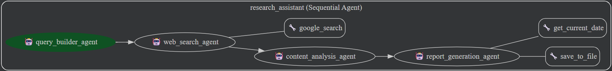

# 🚀 Research Assistant 🚀

 AI-powered multi-agent research assistant that can help you research topics by leveraging the power of 
 large language models and Google Search.

---

## Overview
AI-driven agent designed to facilitate the research of any given topic. A research agent is an advanced 
AI system designed to automatically search, gather, synthesize, and analyze information from vast and 
diverse data sources, often utilizing multiple queries and iterative search strategies to build a 
cohesive understanding of a complex topic. 
Unlike a standard search engine that provides links, a research agent focuses on synthesizing definitive 
answers, generating reports, validating facts, and connecting disparate pieces of data into a structured, 
human-readable output, effectively acting as an automated research assistant.

The agent first take the user's research topic and sequentially call following subagents to reach the topic.

1. `query_builder_agent` sub agent breaks it fown into 3-5 specific effective search queries. 
2. `web_search_agent`: This agent uses the google_search tool to execute the search queries and extract 
the most important facts, data, and insights from the search results, citing the sources.
3. `content_analysis_agent`: This agent reads search result from the previous agent, identify most 
important facts, concepts and insights and evaluate the credibility and source of information.
4. `report_generation_agent`: This agent takes the analyzed content and generates a comprehensive, 
well-structured research report, including an executive summary, introduction, main findings, 
analysis, conclusion, and sources.

It also uses AgentFunction (custom tool) to save file and get current date.
`save_to_file` : Saves research report in markdown (.md) format.
`get_current_date` : Gets the current date to mention in research report.


## Agent Details
The key features of the research include:

| Feature                | Description                                                                                  |
|------------------------|----------------------------------------------------------------------------------------------|
| **Interaction Type**   | Conversational                                                                               |
| **Complexity**         | Medium                                                                                       |
| **Agent Type**         | Multi Agent                                                                                  |
| **Workflow**           | Sequential Agents - Executes sub-agents one after another, in sequence.                      |
| **Session Management** | Shared Session State. All sub-agents within a Sequential Agent share the same session state. |
| **Components**         | Tools: <br/>built-in tool: google_search<br/> custom tool: save_to_file, get_current_date    |
| **Vertical**           | Research                                                                                     |  

## Agent Architecture

Root agent request user to submit the topic for research
When user submits the research topic, root agent calls sub-agents in sequential manner.
1. Query builder agent gets called and build queries for search
2. Web search agent uses google search in-built tool to search all queries
3. Content analysis agent analyzed search result and keeps important facts and create structured content
4. Report generation agent formate the report in mark down syntax and uses save_to_file and get_current_date custom function to generate research report in markdown (.md) file format.

This diagram shows the detailed architecture of the agent workflow and tools used to implement workflow.



## Setup and Installation
1.  **Prerequisites**

    *   Python 3.10+
    *   google-adk package
    *   google api key from google cloud platform
2. **Installation**
    ```bash
    # Clone this repository.
    git clone https://github.com/desainik/research-assistant.git
    cd research-assistant
    # Install the package and dependencies.
    pip install -r requirements.txt
3. **Configuration**
      *   Set up Google Cloud credentials.

        *   You may set the following environment variables in a `.env` file.

        ```bash
        export GOOGLE_GENAI_USE_VERTEXAI=False
        export GOOGLE_CLOUD_PROJECT=<your-project-id>
        export GOOGLE_CLOUD_LOCATION=<your-project-location>
        export GOOGLE_API_KEY=<google-api-key> # Get api key from google could ai studio.
        export GOOGLE_CLOUD_STORAGE_BUCKET=<your-storage-bucket>  # Only required for deployment on Agent Engine
        ```

## Running the agent

  To run the research assistant, execute the following command on terminal:

**Using `adk`**
ADK provides convenient ways to bring up agents locally and interact with them.
You may talk to the agent using the CLI:

```bash
adk run research_assistant
```

Or on a web interface:

```bash
 adk web --port 8000
```
The command `adk web` will start a web server on your machine and print the URL.
You may open the URL such as http://127.0.0.1:8000 and select "research_assistant" in the 
top-left drop-down menu, and a chatbot interface will appear on the right. 
The conversation is initially blank. 

Here are some example requests you may ask to research:


1. Latest advancement in quantum computing and their applications
2. Latest development in renewable energy and storage solutions
3. Advancements in biomedical engineering and personalized medicine
4. Developments in AI safety research
5. Climate change impacts on agriculture and food security
6. The impact of AI on labor and employment
7. Investigate the gut microbiome's connection to human health
8. The effects of social media on mental health, particularly among adolescents and young adults
9. The adoption and impact of cryptocurrencies on traditional financial systems
10. Cybersecurity in an AI-Dominated World


Sampled responses of these few requrests are shown below demo section.

## Agent Demo

### Demo 1 using CLI - Topic: Explore developments in quantum computing and their applications

[Click here](reports/research_report_Latest_advancement_in_quantum__20251129_213457.md) to access Quantum Computing research report generated by an AI agent. 


### Demo 2 using Web - Topic: Research latest development in renewable energy and storage solutions

[Click here](reports/research_report_Latest_development_in_renewabl_20251129_213912.md) to access renewable energy research report generated by an AI agent.


### Demo 3 using InMemorySessionService - Topic: Advancements in biomedical engineering and personalized medicine
#### This is testing using InMemorySessionService

[Click here](reports/research_report_Advancements_in_biomedical_eng_20251129_215324.md) to access biomedical engineering research report generated by an AI agent.


## Running Test
For running test use the following command on terminal.

```bash
python -m tests.test_agent
```
To debug and test the agent, 
Pass the topic under test_agent.py -> run_agent module. 

For example,
```bash
    asyncio.run(run_agent("Advancements in biomedical engineering and personalized medicine"))
```
test and run the agent on a sample request, and makes sure that every component is functional. 
You can call it multiple times in a loop and sends a couple of requests to the agent.

## Deployment
The Research Assistant can be deployed to Vertex AI Agent Engine using the following commands:

```bash
uv run de ployment/deploy.py --create
```
You can list existing agents using:

```bash
uv run deployment/deploy.py --list
```

To delete the deployed agent, you may run the following command:

You can get the agent engine using list command above.

```bash
uv run deployment/deploy.py --delete --resource_id=${AGENT_ENGINE_ID}
```

---